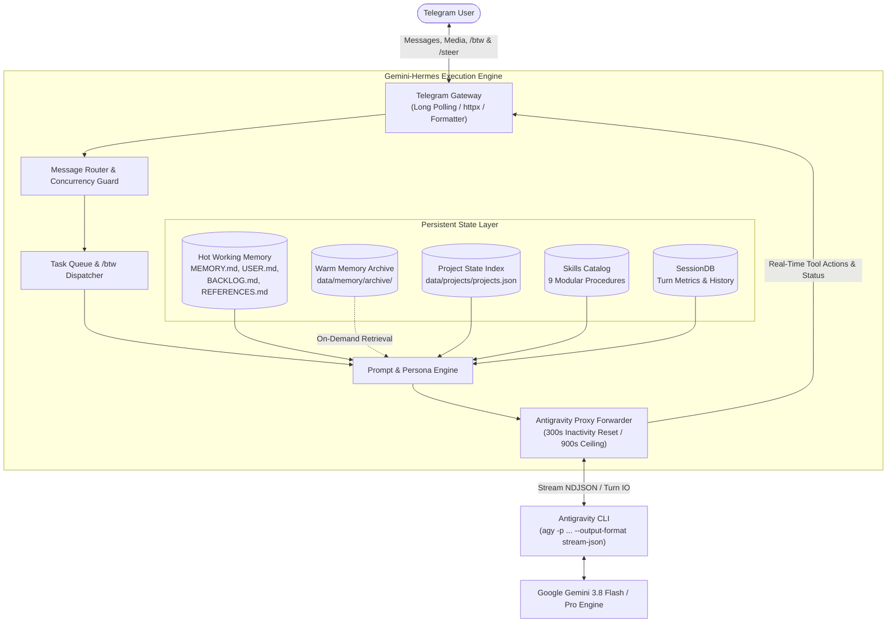

# 🪐 Gemini-Hermes AI Agent `v1.7.0`

**Gemini-Hermes** is an autonomous, persistent, and self-improving AI agent colleague combining **Nous Research's Hermes Agent** cognitive architecture with **Google Antigravity CLI (`agy`)** as its proxy model execution engine, accessible anywhere via a **Telegram Gateway**.

> **Release v1.7.0 Highlights:**
> - **Dynamic Model Selection & 4-Tier Workload Routing**: Intelligent pre-dispatch evaluation via Jev AI System-One that routes prompts across 4 cost-calibrated Antigravity tiers (`gemini-3.6-flash`, `gemini-3.7-flash`, `gemini-3.8-flash`, `gemini-3.1-pro`).
> - **Dynamic Reasoning Effort & Fast-Path Context**: Automatic effort scaling (`low`, `medium`, `high`) and fast-path conversational prompt slimming (~800 tokens, 0 thinking tokens) for trivial chat.
> - **Interactive Terminal UI Dashboard (`./run.sh monitor`)**: Live visual monitoring dashboard displaying active turns, chosen models, reasoning effort, queue depth, and reflex telemetry.
> - **Telegram `/model` Command & Alias Support**: Inspect active models and runtime switch tiers on the fly (`/model 3.6`, `/model 3.7`, `/model 3.8`, `/model pro`).
> - **TypeSafe AI (Jev) System-One Primitives**: Decoupled, modular integration package (`gemini_hermes/jev/`) providing smart `/btw` sidecar intent classification and reflex decision engine.
> - **100% Optional Strict 2-World Architecture**: Standard `./run.sh start` operates with zero external dependencies; accelerated `./run.sh start-jev` activates dynamic model & effort selection.
> - **Expanded Dual Verification Suite**: Automated test suite expanded to **123 passing unit & integration tests** (100% pass rate).

---

## 🏛️ Architecture Overview

Gemini-Hermes follows a Direct Autonomous Orchestrator body-brain design:



---


## ✨ Core Features & Hermes Capabilities

### 1. Direct Solo Execution & Context Hygiene
- **Direct Solo Execution**: Gemini-Hermes acts as a direct, hands-on engineer executing inspections, builds, tests, and file modifications directly in the session.
- **Subagent Prohibition**: Eliminates sub-agent spawning and delegation loops, preventing worker timeouts and context desynchronization.
- **Pristine Primary Context**: Guards the conversation against noise and token bloat with compact, high-signal reasoning traces.

### 2. Project State Indexing (Zero Context Loss)
- **Persistent Project Bookmarks**: Tracks active and completed projects in `data/projects/projects.json`.
- **Context Injection**: Project state, paths, tech stacks, and open milestones are automatically surfaced in the cognitive system prompt.
- **Commands**:
  - `/projects` — List all active and archived projects.
  - `/project <id>` — View detailed task status, stack, and notes.
  - `/project_add <name> <path>` — Bookmark a new project into persistent state.
  - `/project_task <id> <task>` — Attach a task to a project.

### 3. Side-Conversation & Task Queue (`/btw`)
- **Side-Quest / Live Telemetry**: Ask progress or status questions while a background task is running (e.g. `/btw where are you now?` or `/btw what are you working on?`). The bot replies instantly with live telemetry without interrupting the primary task.
- **Steering & Task Queueing**: Send steering directives or follow-up tasks (e.g. `/btw remember to check sources`, `/btw after this, write a summary`). It queues the instruction into an automated FIFO queue.
- **Autonomous Chaining**: Automatically dequeues and executes the queued task immediately once the active operation concludes.
- **Commands**: `/btw <query>`, `/queue`, `/cancel`.

### 4. Mid-Flight Course Correction (`/steer`)
- **Immediate Task Interception**: Cleanly halts an ongoing turn mid-flight when directives change, preventing wasted model execution or unwanted file modifications.
- **Context-Preserving Transition**: Captures prior task objectives, current action progress, and synthesizes an authoritative `[USER STEERING DIRECTIVE]` resuming seamlessly within the same conversation session without race conditions.
- **Idle Direct Execution**: When idle, `/steer <instruction>` immediately executes the directive as a top-priority command.
- **Commands**: `/steer <instruction>`.

### 5. Automatic Chat Queueing ("Zero Message Drop")
- **Multi-Message Conversational Flow**: Send multiple follow-up chats, clarifications, or thoughts naturally on Telegram while the agent is actively executing—no slash commands required.
- **Auto-Enqueue Engine**: Incoming plain text messages and media attachments (photos, documents) sent mid-flight are automatically placed into the sequential FIFO execution queue with instant position confirmation (`#1 in queue`, `#2 in queue`).
- **Capacity Protection**: Built-in capacity guard (`max_queue_size = 10`) protects host memory against spam or runaway queues with polite queue-full warnings.
- **Fault & Crash Resilience**: If an active task encounters an error or is redirected via `/steer`, the sequential queue is preserved and safely drained upon completion.
- **Commands**:
  - `/queue` — View active task status and all pending queued messages.
  - `/cancel` — Instantly abort active execution and flush the task queue.

### 6. Targeted Telegram Message Quoting & Contextual Reply Awareness
- **Visual Threading (Outbound)**: Responses and intermediate status messages pass `reply_to_message_id` with `allow_sending_without_reply=True`, rendering clean visual quote connections directly back to originating user prompts.
- **Inbound Context Injection**: Swiping or replying to previous messages automatically extracts sender and message preview (`[Replying to message from <Sender>: "<preview>"]`), seamlessly injecting context into the prompt.
- **Full Media Quoting Support**: Handles replies quoting text, photos, documents, voice notes, audio files, videos, stickers (with emoji), polls, shared locations, and contacts.
- **Zero-Drop Secondary Fallback**: If Telegram API rejects reply targeting on both Markdown and plain-text attempts, the gateway automatically strips reply parameters and sends directly to guarantee zero lost responses.
- **Command Awareness**: Directives like `/btw` and `/steer` maintain quoted message context when executed as replies.

### 7. Asynchronous Task Monitoring (`task_watcher`)
- **Zero Premature Exits**: Strictly prevents abandoning running builds or operations with premature "running in background" responses.
- **Active Verification**: Follows background tasks through completion via process monitoring and artifact validation.

### 8. Zero Status Spam (In-Place Message Editing)
- **Fluid Telegram UI**: Intermediate tool steps dynamically mutate the current message bubble rather than creating duplicate bubbles in Telegram.
- **Resilient Fallback**: Gracefully falls back to new messages if Telegram API edit limits or deletions occur.

### 9. Tiered Quality Memory & Context Hygiene (`/compact`)
- **Hot Working Context (In-Prompt)**: Dynamic hot memory keeps prompt tokens lean (~2k tokens) by capping resolved milestones to the 4–5 most recent items while retaining 100% of active tasks `[ ]`.
- **Warm Permanent Archive (On-Disk)**: Older completed tasks and multiline verification logs are moved to `data/memory/archive/BACKLOG_ARCHIVE.md`, preserving deep historical records off-prompt for on-demand tool inspection.
- **Dynamic Archival Indicators**: If older tasks are archived, prompt context displays a clean pointer (e.g. `- *(+N older completed tasks archived in data/memory/archive/BACKLOG_ARCHIVE.md)*`).
- **Commands**:
  - `/compact` — One-touch archival pass that trims resolved tasks from hot context and outputs real-time memory metrics.
  - `/memory` — Inspect all modular memory files and current token footprint.
  - `/memory_add <text>`, `/task_add <task>`, `/ref_add <title> | <url>`, `/memory_reset`.

### 10. Deliberate Cadence & Rigorous Dual Verification
- **Slow is Smooth, Smooth is Fast**: Rejects rushed, unverified code changes that create debugging debt.
- **Dual Verification**: Every feature or procedure must pass both positive (happy path) and negative (error boundary and fallback) testing.
- **5-Phase Skill Creation Pipeline**:
  1. **Phase 1: Goal & Boundary Definition** — Scope precise problem, input parameters, expected outputs, and trigger conditions.
  2. **Phase 2: Procedure & Edge-Case Architecture** — Map sequential workflow, isolate failure modes, and specify fallback paths.
  3. **Phase 3: Incremental Draft & Review** — Draft specification in digestible sections conforming to the `agentskills.io` standard.
  4. **Phase 4: Positive & Negative Stress Testing** — Simulate and verify happy-path and error recovery behaviors.
  5. **Phase 5: Catalog Registration & Packaging** — Commit to the active skill catalog only after rigorous verification.

### 11. Dynamic Model Selection & 4-Tier Workload Routing
- **Pre-Dispatch Reflex Triage**: Inbound prompts are evaluated by **Jev AI System-One** to select the most cost-effective Antigravity model and reasoning effort before dispatching to `agy`:
  * **Tier 1 (`gemini-3.6-flash`, `low` effort)**: Cheapest / fastest for simple interaction, greetings, smalltalk, and casual chat (0 thinking tokens on fast reflex).
  * **Tier 2 (`gemini-3.7-flash`, `medium` effort)**: Balanced for standard coding, single-file edits, and moderate debugging.
  * **Tier 3 (`gemini-3.8-flash`, `high` effort)**: High-workload multi-file architecture, complex refactoring, and deep agentic runs.
  * **Tier 4 (`gemini-3.1-pro`, `high` effort)**: Extreme algorithmic reasoning and formal mathematical logic.
- **Telegram `/model` Command**: Inspect active models, view tier pricing breakdowns, and manually switch models on the fly (`/model 3.6`, `/model 3.7`, `/model 3.8`, `/model pro`).

### 12. Interactive Terminal UI Dashboard (`./run.sh monitor`)
- **Real-Time Visual Telemetry**: Monitor the active agent daemon directly in your terminal using a rich layout dashboard.
- **Live Metrics**: Displays daemon status, active Telegram chat ID, task previews, running time, selected model, reasoning effort, fast-path tags, task queue depth, and Jev reflex latency.
- **Commands**: `./run.sh monitor`.

---

## 🛠️ Modular Skills Catalog (9 Active Procedures)

Gemini-Hermes features 9 modular procedures conforming to the `agentskills.io` standard:

| Skill | Category | Description |
|---|---|---|
| `task_watcher` | Background / Verification | Monitoring and actively verifying asynchronous and long-running tasks until confirmed completion. |
| `multi_step_researcher` | Research / Synthesis | Systematic multi-step technical web research, official docs triangulation, and dense synthesis. |
| `auto_debugger` | Debugging / Diagnostics | Error log parsing, stack trace isolation, root cause hypothesis testing, and surgical patching. |
| `api_tester` | API / Validation | Probing REST/HTTP endpoints, contract mapping, curl execution, and JSON schema validation. |
| `system_monitor` | System / DevOps | Host resource auditing (CPU, RAM, disk space), daemon process checks, and cron health alerting. |
| `task_scheduler` | Scheduling / Cron | Procedure for managing delayed tasks, one-shot reminders, and recurring cron operations. |
| `memory_keeper` | Memory / Context | Best practices for managing persistent modular memory (`MEMORY.md`, `USER.md`, `BACKLOG.md`, `REFERENCES.md`). |
| `shell_execution` | Shell / Linux | Safe and effective execution of host shell commands with exit code and error handling. |
| `skill_creator` | Meta / Self-Improvement | Autonomous formulation, validation, and saving of new reusable skills into the knowledge base. |

---

## 📱 Telegram Command Reference

| Command | Description |
|---|---|
| `/start` | Welcome greeting, agent status, and quick instructions |
| `/help` | Complete reference manual of features and commands |
| `/new` or `/reset` | Clear conversation thread, purge task queues, and begin fresh session |
| `/status` | View engine health, active conversation ID, turns, token counts, and indexed projects |
| `/btw <msg>` | Query live telemetry, ask side trivia, or queue follow-up directives while an operation runs |
| `/steer <instruction>` | Immediately course-correct or redirect the agent mid-flight (or apply focused direction if idle) |
| `/queue` | View active background task status and pending `/btw` queued items |
| `/cancel` | Safely abort ongoing background tasks and clear pending queues |
| `/projects` | List all bookmarked projects, status, and repository paths |
| `/project <id>` | Inspect detailed architectural state, notes, and task progress |
| `/project_add <name> <path>` | Bookmark a new project into persistent state |
| `/project_task <id> <task>` | Attach a new task or milestone to an indexed project |
| `/memory` | Inspect modular memory domains (`MEMORY.md`, `USER.md`, `BACKLOG.md`, `REFERENCES.md`) |
| `/compact` | Archive older completed tasks to `data/memory/archive/` and keep working context sharp |
| `/memory_add <text>` | Manually save a permanent operational fact or rule to `MEMORY.md` |
| `/task_add <task>` | Append an active task or inquiry directly to `BACKLOG.md` |
| `/ref_add <title> \| <url>` | Save an external spreadsheet, documentation, or resource link to `REFERENCES.md` |
| `/memory_reset` | Reset persistent memory to default initial state |
| `/skills` | List all modular procedural skills currently installed |
| `/skill <name>` | Display the exact instructions and metadata of a specific skill |
| `/exec <command>` | Run an authorized shell command directly on the host machine |

---

## 🚀 Quick Start Guide

### Step 1: Configure Environment

Run the setup wizard:
```bash
./run.sh setup
```

Or run the interactive configuration editor at any time:
```bash
./run.sh config
```

Or edit `.env` directly:
```env
TELEGRAM_BOT_TOKEN=123456789:ABCdefGhIJKlmNoPQRsTUVwxyZ
TELEGRAM_ALLOWED_USERS=12345678
AGY_BIN=/root/.local/bin/agy
REASONING_EFFORT=medium
STREAM_UPDATES=true
STREAM_EDIT_INTERVAL=1.2

# Optional TypeSafe AI (Jev) System-One reflex layer
TYPESAFE_API_KEY=apik_...
TYPESAFE_API_BASE=https://api.typesafe.ai
TYPESAFE_MODEL=jev-latest
JEV_ENABLED=false
```

*(Optional)* If you wish to use TypeSafe AI (Jev):
```bash
pip install -r requirements-jev.txt
python3 scripts/test_typesafe_live.py
```

### Step 2: Test Diagnostics

Run the comprehensive test suite to verify connectivity and environment readiness:
```bash
./run.sh test
```

### Step 3: Run Gemini-Hermes

**Daemon Mode (Standard Engine):**
```bash
./run.sh background
```

**Daemon Mode with Jev Dynamic Model & Effort (Accelerated):**
```bash
./run.sh background-jev
```

**Interactive Foreground Mode:**
```bash
./run.sh start        # Standard pure engine
./run.sh start-jev    # Jev Dynamic Model & Effort Selector
```

**Live Dashboard & Logs:**
```bash
./run.sh monitor      # Interactive Terminal UI Dashboard
./run.sh logs         # Follow live logs
./run.sh status       # Check daemon PID and status
./run.sh stop         # Gracefully stop daemon
```

---

## 📂 Project Directory Structure

```
agy-hermes/
├── README.md                      # Comprehensive project documentation
├── CHANGELOG.md                   # Semantic version history and release logs
├── requirements.txt               # Core Python dependencies (lean & zero-dependency storage)
├── requirements-jev.txt           # Optional TypeSafe AI (Jev) dependencies
├── run.sh                         # CLI service management script (setup, config, test, start, monitor)
├── restart_bot.sh                 # Graceful lifecycle-aware daemon reloader
├── .env.example                   # Environment configuration template
├── scripts/
│   ├── test_typesafe_live.py      # Standalone live TypeSafe AI primitive test harness
│   └── test_jev_reflex_prefilter.py # Live reflex prefilter tester
├── gemini_hermes/
│   ├── __init__.py                # Package definition (v1.7.0)
│   ├── config.py                  # Settings loader & path constants (v1.7.0)
│   ├── cli.py                     # CLI commands (start, setup, config, test, monitor, status)
│   ├── cli_monitor.py             # Interactive Terminal UI Dashboard
│   ├── telemetry.py               # Zero-locking shared telemetry exporter
│   ├── brain/
│   │   ├── agy_forwarder.py       # Proxy forwarder to Antigravity CLI (--model & --effort)
│   │   └── stream_parser.py       # NDJSON stream and tool event parser
│   ├── jev/                       # Decoupled Jev AI System-One modular package
│   │   ├── client.py              # TypeSafe AI reflex client & decision primitives
│   │   ├── effort_selector.py     # 4-tier dynamic model & reasoning effort selector
│   │   ├── btw_classifier.py      # Smart /btw sidecar intent classifier
│   │   └── adapter.py             # Unified facade for accelerated runtime
│   ├── services/
│   │   └── jev_service.py         # Backward-compatible Jev service wrapper
│   ├── projects/
│   │   ├── __init__.py
│   │   └── manager.py             # Project state indexing & task tracking
│   ├── memory/
│   │   ├── store.py               # Memory persistence and session manager
│   │   ├── archiver.py            # Tiered memory archiver (hot vs. warm)
│   │   └── templates.py           # Default memory blueprints
│   ├── skills/
│   │   ├── manager.py             # Modular skill discovery and parser
│   │   └── builtin/               # Built-in procedural skills
│   ├── persona/
│   │   └── system_prompt.py       # Cognitive depth & prompt builder
│   └── gateway/
│       ├── telegram_bot.py        # Gateway bot facade
│       ├── runner.py              # Turn lifecycle, streaming, and status runner
│       ├── models.py              # Gateway data models (QueuedTask)
│       ├── handlers/              # Modular command & lifecycle handlers (/model, /steer, /btw, /queue)
│       ├── helpers/               # Context parsing & reply extraction
│       ├── services/              # Telegram HTTP transport client
│       └── formatter.py           # Telegram Markdown formatting & sanitizers
├── tests/                         # Dual verification test suites (123 tests)
└── data/
    ├── memory/                    # MEMORY.md, USER.md, BACKLOG.md, REFERENCES.md
    │   └── archive/               # Warm memory archives (BACKLOG_ARCHIVE.md)
    ├── projects/                  # projects.json (bookmarked projects)
    ├── sessions/                  # sessions.json (chat threads & metrics)
    ├── media/                     # Ingested Telegram photos and documents
    └── skills/                    # Custom and learned skills catalog
```
